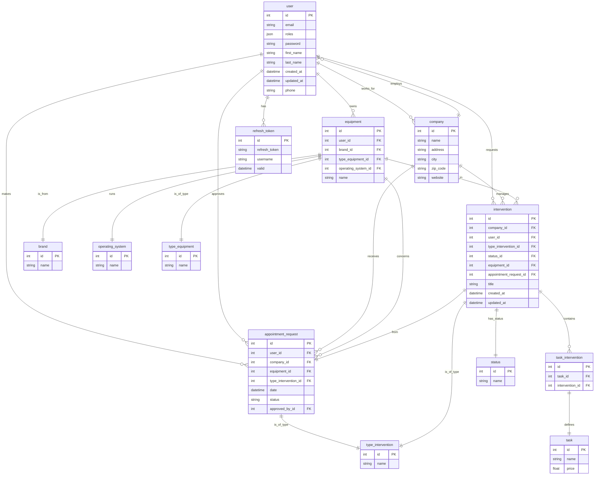
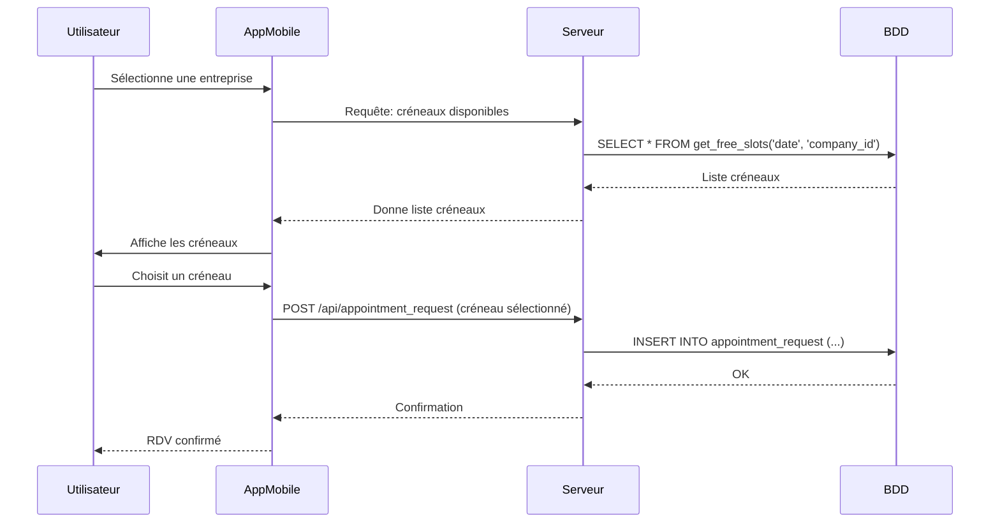
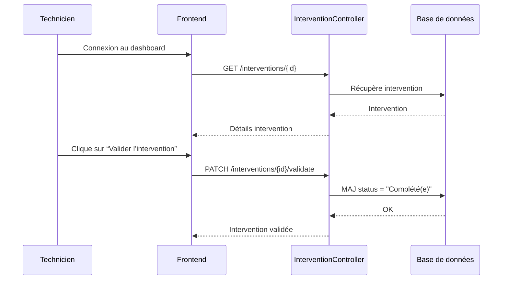
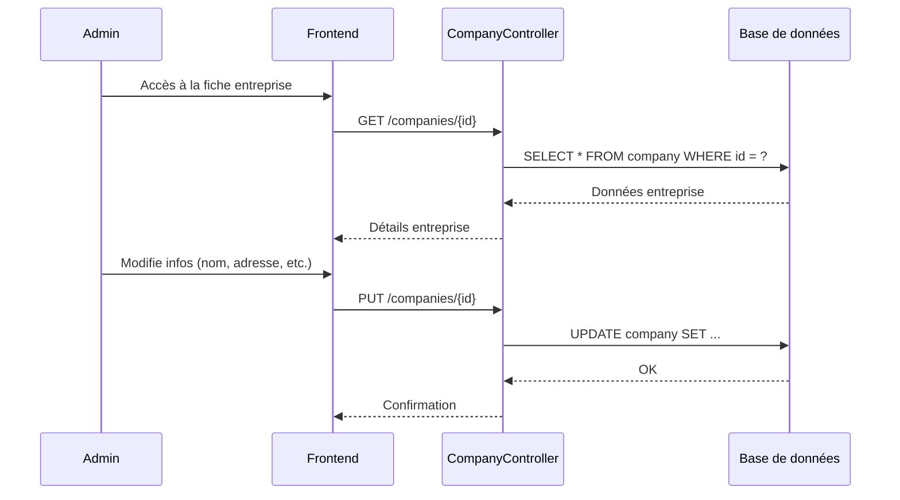
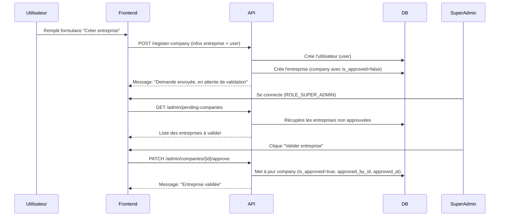
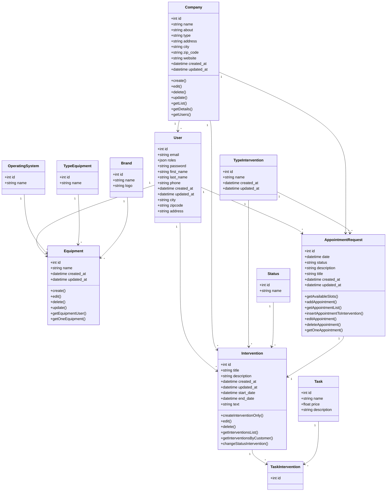

# Développement de l'application

## Installation et Configuration

### Prérequis
- PHP 8.1 ou supérieur
- Composer
- Symfony CLI
- PostgreSQL
- Node.js et npm (pour le frontend)

### Installation du Backend

Si vous utilisez docker, vous pouvez démarrer le projet avec la commande suivante :

```bash
docker compose up -d
```
Si vous n'utilisez pas Docker, suivez ces étapes :
1. Clonez le dépôt :
   ```bash
   git clone
   ```
2. Accédez au répertoire du projet :
   ```bash
   cd proaxive_dev/backend
   ```
3. Installez les dépendances PHP :
   ```bash
   composer install
   ```
4. Configurez votre fichier `.env` :
   ```bash
   cp .env .env.local
   ```
   Modifiez les variables d'environnement selon votre configuration (base de données, clés API, etc.).
5. Créez la base de données :
   ```bash
   php bin/console doctrine:database:create
   ```
6. Exécutez les migrations :
   ```bash
   php bin/console doctrine:migrations:migrate
   ```
7. Chargez les fixtures (facultatif, pour peupler la base de données avec des données de test) :
   ```bash
   php bin/console doctrine:fixtures:load
   ```
8. Démarrez le serveur Symfony :
   ```bash
   symfony server:start
    ```
### Exécution des tests
Pour exécuter les tests, utilisez la commande suivante :

Configurez votre fichier `.env.test` pour les tests unitaires :
   ```bash
   cp .env.example .env.test
   ```
Modifiez les variables d'environnement selon votre configuration de test (base de données, clés API, etc.).

Assurez-vous que les dépendances de test sont installées :

```bash
php bin/console doctrine:database:create --env=test
php bin/console doctrine:migrations:migrate --env=test
php bin/console doctrine:fixtures:load --env=test
```

```bash
php bin/phpunit
```


# Documentation du Modèle

### MCD (Modèle Conceptuel des Données)



### Diagramme de séquence

Prise de rendez-vous client :



Validation d’intervention par un technicien :



Édition d’une entreprise par un admin :



Création d’un équipement (avec type, marque, OS, notes) :

```mermaid
sequenceDiagram
    participant User
    participant Frontend
    participant API as EquipmentController
    participant DB as Base de données

    User->>Frontend: Clique sur “Ajouter un équipement”
    <!-- Frontend->>API: GET /brands, /os, /types -->
    API->>DB: Récupère marques, OS, types
    DB-->>API: Données
    API-->>Frontend: Liste déroulante

    User->>Frontend: Remplit le formulaire (nom, marque, type, OS, note)
    Frontend->>API: POST /equipments
    API->>DB: INSERT INTO equipment (...)
    DB-->>API: OK
    API-->>Frontend: Équipement créé
```

Demande d'une creation d'entreprise par un utilisateur :

| `is_approved` | Signification                      |
| ------------- | ---------------------------------- |
| `null`        | En attente de validation (pending) |
| `true`        | Acceptée par un `super_admin`      |
| `false`       | Refusée par un `super_admin`       |




### Diagramme de class



### Diagramme de composants / Architecture

Composant 1 : Application Mobile (React Native)

    Responsabilités : Interface utilisateur, gestion des états locaux, appels à l'API.

Composant 2 : API REST (Symfony)

    Responsabilités : Logique métier, authentification/autorisation, gestion des requêtes HTTP, interaction avec la base de données.

Composant 3 : Base de Données (PostgreSQL)

    Responsabilités : Stockage persistant des données (utilisateurs, entreprises, appareils, interventions).

Flux de données :

+---------------------+             +---------------------+             +---------------------+
|                     |             |                     |             |                     |
|  Application Mobile | <---------> |      API REST       | <---------> |    Base de Données  |
|    (React Native)   |   (HTTP)    |      (Symfony)      |   (SQL/ORM) |     (PostgreSQL)    |
|                     |             |                     |             |                     |
+---------------------+             +---------------------+             +---------------------+
